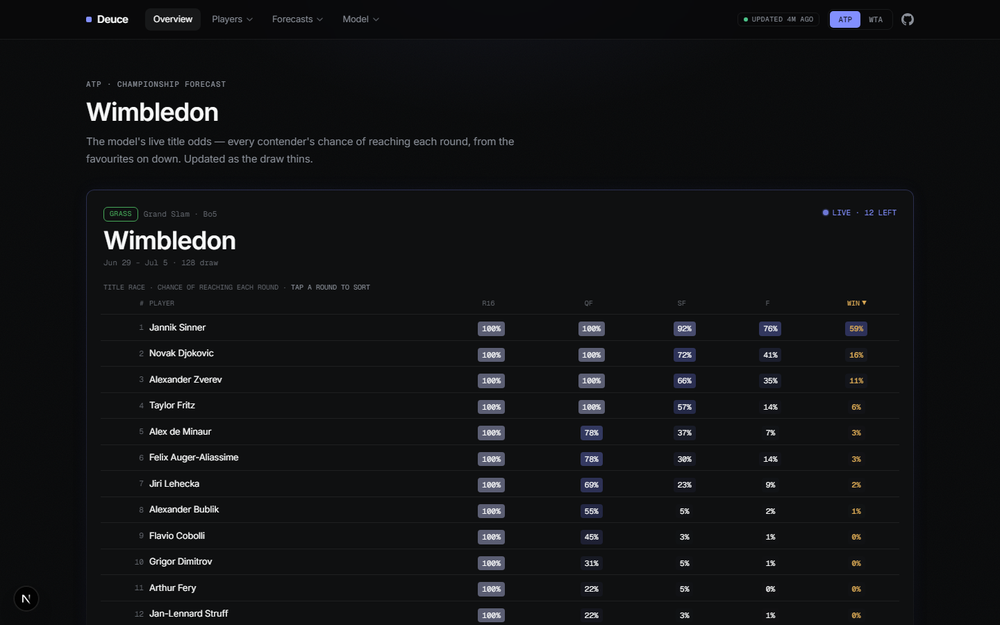
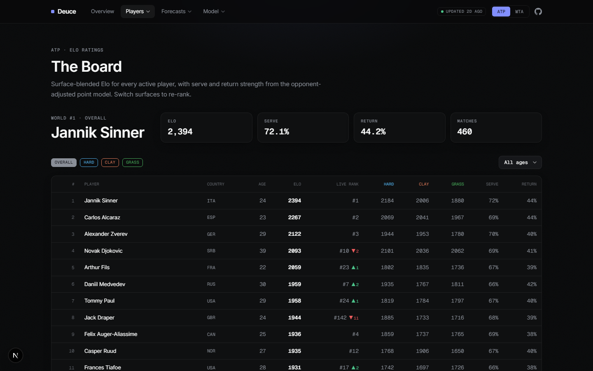
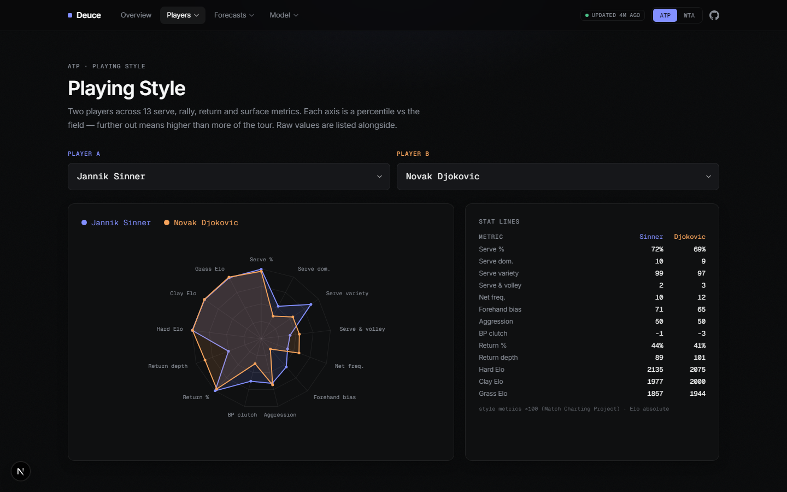

# DEUCE — Tennis Forecast Engine (ATP + WTA)

[](https://github.com/ARJUNVARMA2000/tennis-elo/actions/workflows/refresh.yml)
[](https://github.com/ARJUNVARMA2000/tennis-elo/actions/workflows/test.yml)
[](https://arjunvarma2000.github.io/tennis-elo/)

A hybrid forecasting system for men's and women's professional tennis. It pairs
**surface Elo with cross-surface transfer**, an **opponent-adjusted serve/return
point model**, **Match-Charting style features**, and context signals (rest, fatigue,
H2H, home advantage), fused by a **seed-bagged, Platt-calibrated XGBoost combiner**.
Outputs calibrated match win probabilities, full set-score distributions, Monte Carlo
draw projections, and a live web app — data refreshed **hourly**, retrained daily, for
**both tours**, with a real-time ESPN live-score ticker on the site.

🌐 Live site: **https://arjunvarma2000.github.io/tennis-elo/**

## Screenshots

| Slam forecast + live ticker | Rankings | Playing-style radar |
|---|---|---|
|  |  |  |

## Why this design

Across the literature, sophisticated ML doesn't beat a good Elo on its own — it only
*matches* it, while the betting market is the ceiling (~69% acc / 0.196 Brier). The
winning recipe is a **hybrid**: engineer strong Elo + point-model features, then let
gradient boosting combine and calibrate them. Walk-forward, leakage-free results
(45,762 ATP / 42,513 WTA matches):

| Model (walk-forward 2010–2026) | ATP Brier | WTA Brier |
|---|---|---|
| Surface Elo + cross-surface transfer (tuned per tour) | 0.2006 | 0.2112 |
| Serve/return point model (tuned) | 0.2055 | 0.2148 |
| **XGBoost combiner (seed-bagged)** | **0.1947** | **0.2018** |
| _Bookmaker (literature anchor)_ | _0.196_ | _0.196_ |

The combiner beats every component on both tours, and the ATP model now **clears the
bookmaker anchor on both accuracy (0.696 vs ~0.690) and Brier (0.1947 vs 0.196)** —
the single largest jump came from ingesting ~130k Challenger + qualifying matches
into the rating walks (ratings-only: the combiner still trains on main draws;
d_val +0.0076 ± 0.0010, 17/17 years positive). Every constant is tuned offline per
tour (Optuna, 2010–19 tune window, 2020+ validation — see `eval/tune.py`); feature
importance confirms the thesis: Elo (overall + surface) carries most of the signal.

**How changes get adopted.** Every candidate — a constant, a feature, a training
trick — must pass a paired-SE gate on a held-out window *and* a full walk-forward
arbiter before it ships; component-level wins that don't survive the retrained
combiner are rejected. Failed experiments are documented with their numbers, not
discarded (~15 written-up rejections, including an event-speed serve baseline that
passed its component gate 5/5 and still lost the arbiter), and each round's diff gets
an adversarial multi-agent review before adoption — one caught a Fed Cup
host-mislabeling bug that had inflated the WTA home-advantage gain 5× before it could
ship. Full logs:
[`tasks/tuning-results-2026-07-02.md`](tasks/tuning-results-2026-07-02.md),
[`…-core-round.md`](tasks/tuning-results-2026-07-02-core-round.md),
[`…-autoresearch.md`](tasks/tuning-results-2026-07-02-autoresearch.md),
[`…-2026-07-05-data-round.md`](tasks/tuning-results-2026-07-05-data-round.md).

## Architecture

```
data ─┬─ surface Elo + cross-surface transfer (dynamic K, margin-of-victory)
      ├─ serve/return point model (per-surface, opponent-adjusted; point→game→set→match Markov)
      └─ MCP style + context (rest, fatigue, H2H, hand, rank, home advantage)
                         │
      seed-bagged XGBoost combiner (5×) ──Platt──> calibrated P(A beats B) + set distribution
            ┌────────────┴────────────┐
     match predictor            Monte Carlo draw simulator
```

## Data — hourly fresh (the hard part)

Jeff Sackmann's canonical repos went private in 2026 and the free mirrors keep freezing,
so each tour **merges five sources**, deduplicated with stats-bearing rows winning:

- **Full-schema historical** (serve stats; frozen upstreams, snapshot-backed):
  `Tennismylife/TML-Database` (ATP), a full-schema WTA snapshot.
- **Daily stats overlay** (serve stats, current season): ATP from
  [stats.tennismylife.org](https://stats.tennismylife.org) (TML's daily-updated home);
  WTA **scraped from the first-party wtatennis.com API** (`data/wta_stats.py`) — no free
  bulk source has carried WTA serve stats since mid-2024 (2016+ back-filled from the
  same API).
- **Challenger + qualifying overlay** (ATP, 2005+, serve stats): ~130k lower-tier
  matches feeding the rating walks only — the combiner still trains on main draws
  (`draw_level` gate; the "full" variant measurably destabilized training and was
  rejected).
- **Fresh weekly results** (results-only): `LuckyLoser91/TennisCourtLog` (both tours).
- **Official live rankings**: scraped hourly from live-tennis.eu (`data/rankings.py`)
  to put real ATP/WTA ranks and movement next to the model's Elo board (display only,
  never a model input).
- **Style**: `JeffSackmann/tennis_MatchChartingProject`; **odds benchmark**:
  Tennis-Data.co.uk closing odds (Pinnacle/Bet365), auto-downloaded, never a model input.

Results (the dominant signal) stay current to the hour via **ESPN's live scoreboard
API**. Names are canonicalised across sources so the same player isn't split. A
**GitHub Action** ([`.github/workflows/refresh.yml`](.github/workflows/refresh.yml))
re-pulls ESPN results and redeploys **hourly**, does a full re-download + retrain of
both tours daily, snapshots the raw data to a release asset weekly (upstreams keep
disappearing), and a **freshness sentinel** (`data/health.py`) turns the build red if
any source silently stalls — schema-validated, atomic downloads mean a broken upstream
can never clobber good data.

## Repo layout

```
tennis_model/        Python model + pipeline (see tennis_model/README.md)
  src/tennis_model/  config · data · ratings · points · model · sim · eval
web/                 Next.js 16 app (12 views, ATP/WTA toggle, static export)
.github/workflows/   hourly refresh + daily retrain + weekly snapshot; CI on every push
```

## Engineering quality

- **182 tests green on every push** — 101 pytest (model, data, geo, parity) + 81 vitest
  (lib math, UI logic), plus ruff + eslint and a type-checked static-export build in CI
  ([`.github/workflows/test.yml`](.github/workflows/test.yml)).
- **Cross-language contract tests**: player-name canonicalisation (`name_key`) is
  implemented in both Python and TypeScript and pinned to shared fixtures, so the site
  can never disagree with the pipeline about who a player is.
- **Determinism**: explicit seeds end-to-end (the 5-fit bag averages fixed seed
  variants; `n_bag=1` is bit-identical to the incumbent), with anti-drift regression
  locks on walk-forward outputs.
- **Accessibility**: keyboard-navigable ARIA listbox dropdowns, screen-reader labels on
  the live ticker, non-color cues for the leading player, compositor-only animations.

## Run it locally

```bash
# 1. model: download data, train both tours, write JSON
cd tennis_model && pip install -r requirements.txt
PYTHONPATH=src python -m tennis_model.data.download --kind all
PYTHONPATH=src python -m tennis_model.pipeline --tour all --backtest

# ad-hoc queries
PYTHONPATH=src python -m tennis_model.cli predict "Jannik Sinner" "Carlos Alcaraz" --surface Hard --bo 5
PYTHONPATH=src python -m tennis_model.cli project-slam "Wimbledon" 2025

# 2. web: dev server (reads tennis_model JSON, mirrored to web/public/data)
cd ../web && npm install && npm run dev
```

## The twelve views

Slam-focus home (round-by-round title forecast + **live ESPN score ticker with model
win odds, polled straight from the browser**) · Rankings (Elo board with **official
live ranks** and an age filter) · Match Predictor · Draw Simulator · Latest results
(with model calls) · Player profiles (Elo history, surface splits, serve/return +
style fingerprint, H2H) · Playing-style radar · Serve/return strength map · Trends &
movers · Accuracy vs market · Track record · Method — all with an ATP/WTA toggle, a
Linear-style dark UI, and an "updated Xm ago" freshness pill.
