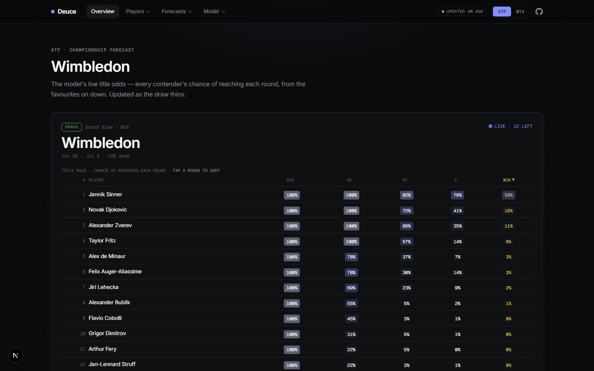
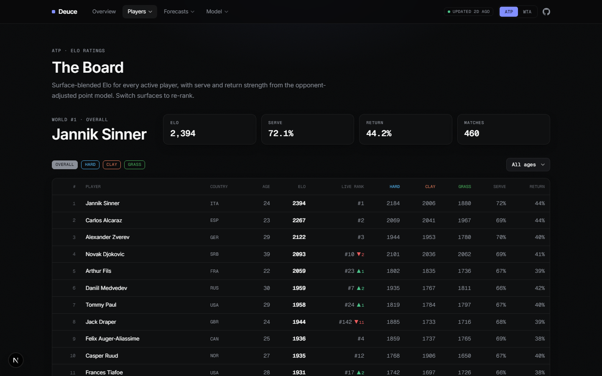
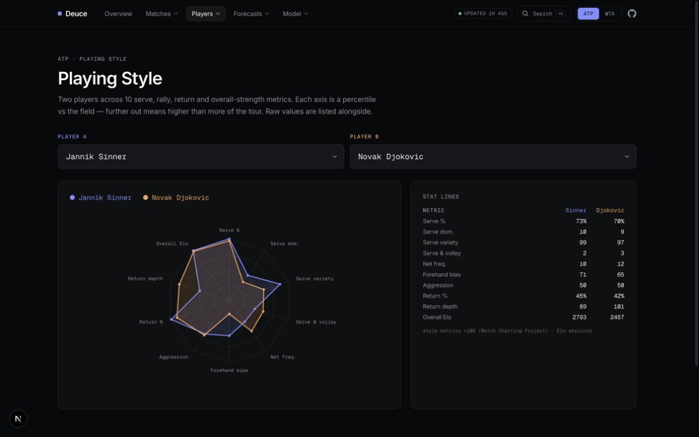

# DEUCE — Tennis Forecast Engine (ATP + WTA)

[](https://github.com/ARJUNVARMA2000/tennis-elo/actions/workflows/refresh.yml)
[](https://github.com/ARJUNVARMA2000/tennis-elo/actions/workflows/test.yml)
[](https://deuce-forecast.web.app/)

DEUCE is a production forecasting system for men's and women's professional tennis. It combines
a leakage-free machine-learning pipeline, a resilient multi-source data platform, and a full-stack
web product that turns live tour data into calibrated match, set-score, and tournament forecasts.

**[Open the live app](https://deuce-forecast.web.app/)** ·
**[View the model scorecard](https://deuce-forecast.web.app/scorecard/)** ·
**[Read the methodology](https://deuce-forecast.web.app/method/)**

## At a glance

| | |
|---|---|
| **Product** | Live ATP/WTA scores and forecasts, real tournament brackets, exact what-if scenarios, player dossiers, rankings, and model-vs-market reporting |
| **Model** | 42-feature hybrid: surface Elo + opponent-adjusted serve/return Markov model + context and Match Charting style, fused by a five-seed XGBoost ensemble and Platt calibration |
| **Evidence** | Leakage-free walk-forward evaluation; 0.1950 ATP and 0.2017 WTA Brier on the measured 2010–2026 research window |
| **Operations** | Hourly data refresh and deployment, daily retraining, weekly recoverable data snapshots, two deployment gates, deduplicated alerts, and an independent liveness watchdog |
| **Stack** | Python, pandas, NumPy, scikit-learn, XGBoost, Next.js 16, React 19, TypeScript, GitHub Actions, and Firebase Hosting |

## Product

- **Live decision surface:** one Match Center combines browser-polled ESPN scores, scheduled model
  calls, completed point-in-time forecasts, evidence behind each call, and a ranked watchlist.
- **Real-draw forecasting:** every connected ATP/WTA bracket can show the actual draw, an exact
  probability path, or a shareable scenario with forced results. Confirmed results are immutable;
  what-if choices never enter model evaluation.
- **Player intelligence:** official-rank and Elo boards, overall and surface ratings, player
  dossiers, forecast performance versus expectation, H2H, recent form, style radars, and a
  serve/return strength map.
- **Model accountability:** walk-forward calibration, a durable live forecast log, and paired
  comparisons with bookmaker closing lines and Kalshi snapshots are published alongside the
  forecasts—not kept in an offline notebook.

## Screenshots

| Slam forecast | Rankings | Playing-style radar |
|---|---|---|
|  |  |  |

## Measured performance

The central design choice is a hybrid model. Sophisticated ML does not reliably beat a strong Elo
by replacing it; gradient boosting is most useful when it combines well-engineered rating, point,
style, and context signals and then calibrates their output.

Walk-forward, leakage-free results below cover 45,831 ATP and 42,126 WTA scored matches. They were
measured on 2026-07-25 with data through 2026-07-24; market odds are evaluation-only and are never
model inputs.

| Model (walk-forward 2010–2026) | ATP accuracy | ATP Brier | WTA accuracy | WTA Brier |
|---|---:|---:|---:|---:|
| Surface Elo + cross-surface transfer | 0.682 | 0.2006 | 0.662 | 0.2114 |
| Serve/return point model | 0.669 | 0.2055 | 0.644 | 0.2152 |
| **XGBoost combiner (five-seed ensemble)** | **0.696** | **0.1950** | **0.685** | **0.2017** |
| _Bookmaker literature anchor_ | _0.690_ | _0.196_ | _0.690_ | _0.196_ |

The ATP model clears the literature anchor on this full research window. On the repository's own
odds-matched subset, the closing market still leads 0.201 to 0.203 Brier—an important distinction
that is shown on the live Scorecard rather than hidden behind the headline metric. The largest
adopted improvement came from adding roughly 130,000 ATP Challenger and qualifying matches to the
rating walks while keeping lower-tier rows out of combiner training: validation improved by
`d = +0.0076 ± 0.0010`, with all 17 evaluated years positive.

WTA uses a stricter dual-state design because global lower-tier admission harmed established
top-50 matchups. The model keeps main-only and qualifying/125-enriched state bundles, selecting the
enriched bundle only when either player has fewer than 32 prior main-draw matches. The threshold was
chosen on 2010–2019, then improved 2020+ paired log loss by +0.00098 ± 0.00066 and the
outside-top-50 slice by +0.00145 ± 0.00059; gate-protected rows are bit-identical to baseline.

### How a model change ships

Every candidate constant, feature, or training change must pass the same protocol:

1. Tune on 2010–2019 without looking ahead.
2. Clear a paired per-match difference ± standard-error gate on 2020+.
3. Survive the full walk-forward arbiter with the combiner retrained.
4. Ship its prediction-time state mirror and parity test if it changes walk-time features.
5. Record the result—including rejected experiments—in the research ledger.

Component-level wins are not enough. An event-speed serve baseline, for example, passed its own
component gate in every fold but was rejected when the retrained combiner absorbed it. The
[`research program`](tasks/research/PROGRAM.md) defines the standing protocol, and every attempt is
recorded in the machine-readable [`research ledger`](tasks/research/ledger.tsv).

An optional [`prospective comparison workflow`](tasks/research/PROSPECTIVE.md) freezes an
incumbent and candidate before collecting future paired forecasts. It preserves source and
timing evidence, excludes calls that cannot be proved pre-match, and supplements the arbiter
without changing production predictions or automatically adopting a candidate.

## Architecture

```text
historical + current match data
      │
      ├─ surface Elo
      │    overall + per-surface ratings, cross-surface transfer, dynamic K, margin of victory
      │
      ├─ serve/return point model
      │    opponent-adjusted skill walk → point → game → tiebreak → set → match Markov chain
      │
      └─ context and style
           rest, workload, form, H2H, hand, rank, age, home advantage, Match Charting profile
                              │
                 42-feature XGBoost ensemble (5 fits)
                              │
                       Platt calibration
                              │
              calibrated P(A wins) + set-score distribution
                        ┌─────┴─────┐
                match products   tournament products
                                  ├─ exact propagation through released draws
                                  └─ Monte Carlo simulation for hypothetical fields
```

The system records every feature before its match in one chronological pass. Winner-oriented rows
are randomly sign-flipped during training, so the model cannot learn that the first player is the
winner. The production ensemble averages five deterministically seeded fits; exact dependency pins
protect the serialized model from cross-version drift.

## Data engineering

No single free source is both current and complete. Jeff Sackmann's canonical repositories went
private in 2026, several mirrors froze, and current WTA serve statistics have no maintained bulk
feed. DEUCE therefore merges sources by role and keeps the last validated file when an upstream
fails:

- **Full-schema history:** `Tennismylife/TML-Database` for ATP plus a snapshot-backed WTA archive.
- **Current serve statistics:** daily ATP files from
  [stats.tennismylife.org](https://stats.tennismylife.org); WTA match statistics scraped from the
  first-party wtatennis.com API, including a snapshot-preserved backfill.
- **Lower-tier evidence:** ATP Challenger and qualifying rows feed rating, point, and context state
  from the 2005 warm-up boundary onward, while the combiner still trains and scores on main draws.
  First-party WTA qualifying/125 rows feed a separate secondary state from 2016 onward. A frozen
  main-draw-experience gate uses it only for cold-start matchups; the main-only state is preserved
  for established players and the combiner still trains solely on main draws.
- **Fresh results:** `LuckyLoser91/TennisCourtLog` provides a weekly results overlay; ESPN supplies
  hourly scores, completed results, schedules, and the current event frontier.
- **Rankings, style, and market benchmarks:** live-tennis.eu supplies display-only official ranks;
  the Match Charting Project supplies tactical profiles; Tennis-Data and Kalshi are evaluation-only.
- **Complete draws:** official ATP/WTA main-draw PDFs are preferred. Wikipedia is the complete-draw
  fallback, and ESPN's day-by-day order of play is retained as an explicitly partial frontier.

### Identity and draw integrity

Names are not treated as stable identifiers. Events join on ESPN's `espnId`; sponsor-title and city
aliases are attached to that identity only after calendar and shared-player evidence agrees. An
official draw must overlap the ESPN calendar and match at least 75% of the live field before it can
attach. Player-name canonicalization is implemented in both Python and TypeScript and pinned to one
shared fixture so the model and UI cannot disagree about who a player is.

A separate weekly proposer scans for unresolved identities, sends only deterministic candidates to
a search-enabled model for adjudication, rejects anything contradicted by the match record, and can
open a PR. It never runs in the hourly pipeline, cannot merge its own proposal, and adds no LLM
client to the production dependency set.

## Production operations

```text
hourly at :17 UTC                    daily at 06:00 UTC
ESPN/live draws + rankings           validated source downloads
reuse saved predictor                full rating walk + retrain + backtest
             └──────────────┬──────────────┘
                            ▼
                  pre-deploy output gate
                            ▼
               static Next.js build → Firebase
                            ▼
                    live deploy verifier

Monday full run → rolling raw-data release snapshot
daily watchdog  → alert if refresh.yml has no success within 26 hours
```

The workflow is deliberately failure-aware:

- **Validated, atomic acquisition:** schema or payload failures do not overwrite the last good
  source file. A failed full download does not discard usable data or prevent a retrain; it is
  escalated after the best-effort deploy so the failure remains visible.
- **Pre-deploy integrity gate:** typed `output_findings()` block internally inconsistent artifacts before
  Firebase sees them—missing JSON, impossible draw geometry, placeholder identities, incoherent
  probabilities, or broken cross-file contracts leave the previous good deploy live.
- **Accepted artifact releases:** cached predictors are verified against exact-byte/runtime/configuration
  envelopes before deserialization. Each all-tour run seals one exact ATP+WTA public-data manifest;
  only the gate-accepted release is published, and single-tour/debug runs cannot mutate the live tree.
- **Post-deploy serving gate:** the live verifier checks every route, canonical and crawl metadata,
  cache policy, MIME types, trailing-slash and 404 behavior, the exact freshly generated health
  stamp, every declared release byte/hash/MIME and index edge, known-private/omitted-path 404s,
  event coverage, shard generations, and page-level UI contracts.
- **Actionable monitoring:** every actionable data finding has a stable fingerprint and its own
  independently recoverable GitHub issue—including findings that block before deploy. Serving and
  pipeline failures retain their mode-keyed incident owners. Standing failures suppress repeated
  hourly alerts, leave a daily full-run heartbeat, and close automatically on recovery. A separate
  watchdog covers the failure mode where the refresh workflow itself stops running.
- **Recoverable state:** data and trained artifacts are cached after every run, including late red
  runs; a rolling weekly release snapshot can bootstrap the historical archive if the cache or an
  upstream disappears.
- **Honest source health:** source cadence is interpreted by contract. A missing or invalid Match
  Charting download is actionable, while the age of its volunteer batch data is shown as a coverage
  note rather than misreported as an outage.

Both deployment gates are executable specifications with focused tests:
[`tennis_model/src/tennis_model/data/health.py`](tennis_model/src/tennis_model/data/health.py),
[`tennis_model/tests/test_health.py`](tennis_model/tests/test_health.py),
[`web/scripts/verify-deploy.mjs`](web/scripts/verify-deploy.mjs), and
[`web/tests/verify-deploy.test.ts`](web/tests/verify-deploy.test.ts).

## Engineering quality

- **CI on every code change:** Python and TypeScript tests, Ruff, ESLint, a full TypeScript check
  including test files, and a production static-export build.
- **Deterministic model artifacts:** explicit random seeds, a fixed five-fit ensemble, parity locks,
  and dependencies pinned to the versions used by the production pickles.
- **Point-in-time evaluation:** forecasts are appended before play, graded after results arrive, and
  persisted outside the evictable runtime cache. Bookmaker and Kalshi data never influence a call.
- **Cross-runtime contracts:** identity, bracket math, scenario propagation, artifact schemas, and
  output generations are checked across the Python producer and TypeScript consumer.
- **Web quality:** responsive navigation, keyboard-accessible ARIA controls, screen-reader live-score
  labels, non-color indicators, canonical URLs, structured metadata, and immutable caching only for
  content-hashed assets.

## Repository layout

```text
tennis_model/                  Python model and data pipeline
  src/tennis_model/data/      acquisition, normalization, identity, draws, health
  src/tennis_model/ratings/   chronological overall and surface Elo walks
  src/tennis_model/points/    opponent-adjusted serve/return model and Markov math
  src/tennis_model/model/     features, training, prediction, export, watch ranking
  src/tennis_model/sim/       exact bracket propagation and Monte Carlo simulation
  src/tennis_model/eval/      backtests, tuning, market comparison, forecast ledger
web/                          Next.js 16 / React 19 static application
.github/workflows/            CI, hourly/daily refresh, watchdog, identity proposer
tasks/                        experiment logs, research ledger, decisions, and lessons
```

The model package has a deeper module and methodology guide in
[`tennis_model/README.md`](tennis_model/README.md).

## Run locally

The WTA serve-stat backfill exists only in the rolling release snapshot, so a production-equivalent
checkout must restore that archive before downloading current sources.

```bash
# Model and data pipeline
cd tennis_model
gh release download data-archive --pattern 'raw-archive.tar.gz' -O /tmp/raw-archive.tar.gz
tar -xzf /tmp/raw-archive.tar.gz -C data

PYTHONPATH=src uv run --with-requirements requirements.txt \
  python -m tennis_model.data.download --kind all
PYTHONPATH=src uv run --with-requirements requirements.txt \
  python -m tennis_model.pipeline --tour all --backtest

# Ad-hoc calibrated prediction
PYTHONPATH=src uv run --with-requirements requirements.txt \
  python -m tennis_model.cli predict "Jannik Sinner" "Carlos Alcaraz" --surface Hard --bo 5

# Web application (reads the JSON mirrored into web/public/data)
cd ../web
npm ci
npm run dev
```

Run the verification suites from their package roots:

```bash
cd tennis_model && PYTHONPATH=src uv run --with-requirements requirements.txt pytest -q
cd ../web && npm test && npm run lint && npx tsc --noEmit && npm run build
```

## Current limitations

- WTA qualifying and 125-level history begins in 2016, so the adopted gate improves cold-start
  players rather than providing the long warm-up that ATP Challenger history does. Established
  matchups deliberately stay on the main-only state.
- Hypothetical-field simulations use current ratings. A historically faithful tournament
  simulation would require reconstructing every player's rating state at the event date.
- Match Charting is a volunteer, batch-updated dataset. Its age describes tactical-feature coverage,
  not source transport health; missing profiles degrade to neutral style features.
