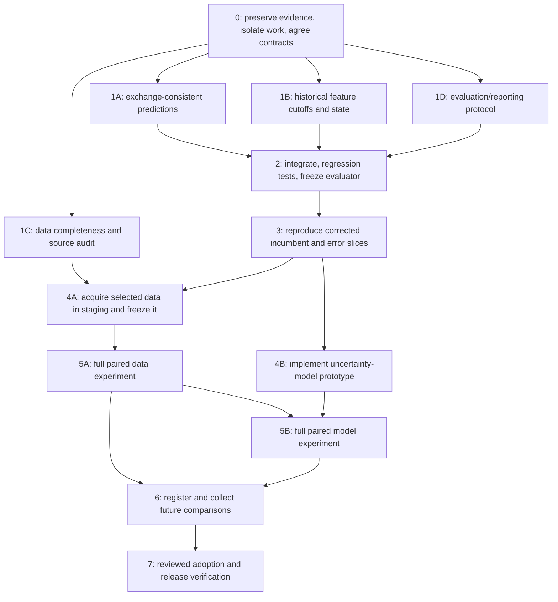

# DEUCE model improvement — implementation and research handoff

Status: **Phase 0 complete. Phases 1–7 have not started.**

Resume from the [Phase 0 review](2026-09-06-phase0-review.md),
[fixed interface decisions](2026-09-06-phase0-interfaces.md), and
[result summary](2026-09-06-phase0-result.json). The review records the prepared
worktrees, snapshot identity, reproduced measurements and exact next steps.

Authorization update: the user requested “start with phase 0.” Preparation, evidence
preservation, isolated workspaces, baseline checks and interface decisions are in scope.
Model/evaluator repairs and numerical candidate searches remain later phases.

User request: turn the completed assessment into a detailed, resumable plan, including
dependencies and work that can run in parallel. The next implementation session should
start here, then read the linked evidence. This request authorizes producing the plan;
it does not start a research run, data purchase, scheduled collector, or deployment.

Planning base: `f4a221b` (deployment documentation), whose model/evaluator/web code is
unchanged from assessed commit `e1702985bd2849905c9a4ea40c05243eca312dc7`.
Recheck history on resume. The separate bracket deployment has completed, as recorded
in the preceding `tasks/todo.md` entry; do not restart that deployment.

All paths below are relative to `/Users/varma/Projects/DEUCE` unless a command sets
another directory. Existing function names are navigation anchors, not frozen line
numbers. Files explicitly marked **new/proposed** do not exist yet.

## 1. Read first; distinguish evidence from proposals

Read these before designing another experiment:

1. Root `AGENTS.md`, the user/global planning conventions, and the tail of `tasks/todo.md`.
2. [Completed assessment](2026-09-06-model-improvement-assessment.md).
3. [Recorded measurements and artifact fingerprints](2026-09-06-model-assessment-evidence.json).
4. `tasks/lessons.md`, then relevant entries in `tasks/lessons/model-research.md`:
   feature-cache identity, state-only A/Bs, full-frame priors, prediction parity,
   protected WTA rows, and strict artifact validation. Read gate/data-source lessons
   when implementing the corresponding workstream.
5. `tasks/research/PROGRAM.md`, `ideas.md`, `ledger.tsv`, and `PROSPECTIVE.md`.
6. `tasks/tuning-results-2026-07-05-data-round.md`,
   `tasks/tuning-results-2026-07-06-autoresearch-r2.md`, and
   `tasks/tuning-results-2026-07-09-codex.md` for prior positive and negative results.

### Completed research — do not redo the whole investigation

| ID | Evidence established | What has NOT been established |
|---|---|---|
| F1 | Saved predictors give different implied probabilities under player exchange. For 435 pairs per tour, mean discrepancy ATP 0.973 pp / WTA 1.466 pp; maxima 4.683 / 6.632 pp. | Accuracy/log-loss benefit of a correction; prevalence on all published match cards. |
| F2 | `features._assemble` attaches current career-aggregate MCP profiles to historical rows; `charting._totals` has no prediction-date cutoff. | Size of score optimism; historical publication-time completeness of charting data. |
| F3 | `run_serve_return` computes priors over its full supplied frame. A shared A/B baseline frame prevents population drift but does not make the prior chronological. | Size of score optimism; best legitimate prior implementation. |
| F4 | 2025 completed-row serve-stat coverage is ATP 91.2% of 2,809 rows and WTA 83.4% of 2,402. Partial 2026 is ATP 94.5% of 2,187 and WTA 99.4% of 1,991. | Independent completeness of the match population, or recoverability of missing fields. |
| F5 | WTA 2024 has 100% serve-stat coverage among 2,078 recorded completed rows. | Whether the year is complete. High field coverage cannot detect absent matches. |
| F6 | Archived WTA threshold-32 A/B: 15,247 validation pairs, delta LL +0.00098225, naive SE 0.00065944, about 1.49 SE. | Independent prospective confirmation, clustered uncertainty, or current-tip performance. |
| F7 | Historical ATP state-only lower-tier addition reported +0.00756 ± 0.00100 validation LL; full lower-tier combiner training failed. | The same gain after the evaluation corrections; general benefit from arbitrary additional rows. |
| F8 | Repeated Elo/XGB/context sweeps and several feature families were rejected; some component wins failed the full arbiter. | That every different model family is exhausted. |

F1/F4/F5/F6 are computed diagnostics. F2/F3 are verified source-level information paths.
F7/F8 are recorded historical experiments under their then-current methodology. None
is a new candidate adoption. Keep these evidence classes separate in future reports.

### Exact local evidence available at planning time

The JSON evidence file records SHA-256, byte size, runtime, and predictor IDs for:

- `tennis_model/data/output/{atp,wta}/predictor.pkl` and sibling `.envelope` files;
- `tennis_model/data/output/{atp,wta}/players.json`;
- `tennis_model/data/output/tuning/ab_gated_wta_base.pkl` and `ab_gated_wta_t32.pkl`.

ATP predictor ID: `6698386b-2d0c-41b3-b7d8-95a72e43c1df`, trained 2026-09-06 16:42:22 UTC.
WTA predictor ID: `c28905e5-36d9-455f-b5a5-f1618372e04d`, trained 16:42:26 UTC.
Both use population version 6; WTA's threshold is 32. The existing local Python
environment was 3.13.14. Hashes were recorded in the follow-up planning session and
the predictor IDs match the assessment. No complete immutable raw-data snapshot was
created. Do not describe these fingerprints as a complete reproduction bundle.

The exact probe used non-null exported `liveRank`, sorted ascending, first 30 players,
all unordered pairs, then two separate calls with Hard / best-of-three / outdoor /
tier weight 1 / round order 3 / no event / as of 2026-09-06. Earlier exploratory
selection by Elo produced a different sample; the final evidence uses **liveRank**.

The archived A/B is through 2026-08-17, not through the September production rebuild.
The local September `meta.json` has `backtest: null`; README figures are historical
measurements, not a newly reproduced September baseline.

## 2. Dependency graph and what can run in parallel



The graph describes the default first campaign. Phase 5A runs before 5B; an explicit
pre-round choice may reverse that order, but not after inspecting validation results.
If one candidate family has no credible entry, record SKIP and continue with the other.
Phase 6 may start for an already selected candidate while later independent work
continues; do not change that registered candidate based on incoming results.

### Parallel work rules

| Work | Parallel? | Constraint |
|---|---|---|
| Failing fixtures, source audit, source-coverage census, protocol design | Yes | Separate outputs; one coordinator owns the shared plan/ledger. |
| 1A prediction code and 1B temporal feature code | Yes, in isolated worktrees | Both eventually touch predictor construction; integrate those edits sequentially. |
| 1B charting and serve-prior subcomponents | Possible | Distinct modules, but one owner integrates feature assembly and state serialization. With three workers, keep both under the same owner. |
| Unit tests in independent worktrees | Yes | No shared caches, raw writes, output tree, or predictor artifacts. |
| Data-source discovery and uncertainty-model design | Yes | Neither can use an evolving candidate validation result to steer the other. |
| Data acquisition and model coding after phase 3 | Yes | Acquisition writes only a staging copy; the coding worker keeps the frozen incumbent inputs. |
| Two different numerical hypothesis searches | No under current PROGRAM.md | Keep experiment verdict order unambiguous; changing this rule needs a separate reviewed protocol change before a round. |
| ATP/WTA Tier-1 runs of the same hypothesis | Allowed | Profile CPU contention first; cap thread counts per process. Earlier measured saving was about 19%, not 2x speed. |
| Tier-2 full A/B arbiters | Sequential | Includes tour arms; an adoption changes the incumbent for the next comparison. |
| Prospective collection and unrelated offline work | Yes | Immutable registrations and independent source timing; no peeking-driven candidate edits. |
| Merges, contract/schema changes, adoption decisions, publishing | Sequential | Coordinator owns the order and revalidates the integrated tree. |

Suggested team for a four-agent capacity, when implementation is authorized: coordinator
plus A (prediction consistency), B (temporal features), C (data audit). Coordinator owns
D (protocol), shared integrations, `tasks/todo.md`, ledger, config/schema version changes,
and final verdicts. This plan does not itself launch those agents.

Use separate physical worktrees and output directories. Raw snapshots may be copied or
reflinked into worker roots; do not use writable hard links or symlinks through trusted
artifact paths. `config.py` derives data/output paths from the checkout, so a new worktree
does not automatically have the existing archive. Never let two workers write the same
Optuna DB, feature cache, prospective registration, or accepted production output tree.

## 3. Phase 0 — prepare a reproducible workspace and agree interfaces

Dependencies: user check-in authorizing the implementation scope. Planning is complete
when this document is reviewed; ordinary implementation choices inside the authorized
scope do not require repeated permission requests.

- [x] Re-read Git status/history and the latest task-log tail. Preserve independent edits.
- [x] Save the plan, assessment, evidence and relevant task-log entries in version control
      before creating worktrees from commits. Stage only the intended documentation;
      do not sweep in unrelated pending changes. These documents were initially local.
- [x] Create an isolated maintenance branch from the verified tip. Use the repository's
      `research/YYYY-MM-DD` convention for later PROGRAM rounds; maintenance work may
      use `codex/` branches. Record actual names and SHAs rather than assuming them.
- [x] Snapshot raw inputs, normalized-frame identity, charting files, predictors/envelopes,
      config, feature schema, dependency identity, selected player lists and saved A/Bs.
      Put binaries in a private durable research directory, not Git or the web mirror.
      Record manifests and row keys; verify copied predictor artifacts normally.
- [x] Allocate unique worker roots and scratch/cache/output destinations; check disk space.
- [x] Reproduce the exchange diagnostic and the archived paired delta once against the
      preserved files. If hashes differ, label a new observation instead of expecting
      old numbers. Never bypass a predictor contract to reproduce an obsolete binary.
- [x] Run the incumbent Python suite and Ruff once in the isolated environment. If it
      fails, diagnose before candidate work. Do not silently refresh data to make it pass.
- [x] Write a small design decision record fixing the interfaces described below.

Interface decisions to agree before workers edit shared callers:

1. One shared calibrated probability helper for paired feature orientations; no separate
   scalar/matrix/evaluation probability formulas.
2. A temporal style-state object with explicit evidence cutoff, counts and current profile;
   an immutable saved snapshot for prediction. Historical replay cannot read today's
   global profile cache.
3. A serve-prior policy with explicit initialization and update rules, the same in historical
   state and saved inference state, including WTA main/enriched separation.
4. An outcome-independent evaluation orientation and unchanged tune/validation boundaries.
5. Versioned receipts/cache identity and ownership of contract/schema edits.

Exit: evidence manifest, clean isolated runtime, known baseline test state, owner map,
and the five interface decisions saved. Runtime/setup time is measured here; later budget
estimates must use this machine, not assume the July timing table still applies.

## 4. Phase 1A — make predictions invariant to player exchange

Owner A. Depends on phase 0. Can run alongside B, C and protocol design.

Existing targets: `model/predict.py` (`win_prob`, `prediction_components`, evidence
methods, `prediction_matrices`, `win_prob_matrix`), `model/train.py` fold output,
`model/features.py` (`ANTISYM`, `SYMMETRIC`), `model/export.py`, and callers in
`model/upcoming.py`, `sim/`. All model paths are under `tennis_model/src/tennis_model/`.
Proposed shared implementation: `model/probability.py` (new).

Default minimal implementation, without adding model features or tuning hyperparameters:

`q(A,B) = 0.5 * [g(features(A,B)) + 1 - g(features(B,A))]`

Here `g` includes the fitted combiner AND calibration. Both orientations must be
independently evaluated. Complementing one computed value to fill a matrix is not
evidence that the raw predictor is invariant to reordering.

- [ ] Add an intentionally asymmetric stub predictor fixture that fails the current
      direct-call contract. Assert the real exported scalar and matrix APIs, not merely
      that one pre-complemented matrix is internally symmetric.
- [ ] Implement the shared vectorized helper, applying antisymmetric sign changes only
      to the appropriate features and keeping match context unchanged.
- [ ] Route single-match, component, evidence, neutralized-feature evidence and matrix
      calculations through it. Audit every direct `clf.predict_proba` consumer.
- [ ] Have the coordinator connect the helper to ordinary and WTA state-gated walk-forward
      prediction. Calibration/training redesign is a later experiment, not an extra knob
      in this consistency fix.
- [ ] Preserve eligibility, WTA bundle selection, and frozen historical forecast receipts.
      Reversing a pair must select the same complete WTA state bundle.
- [ ] Add a pre-upload gate witness generated from independent direct predictions in both
      orders and permutation tests; do not rely on `_check_matrix`'s existing complement
      check, which already passes the defective behavior.

Gate integration is coordinator-owned. Recommended design: a bounded private prediction
audit receipt tied to predictor artifact ID, inference schema, context and input generation,
produced on both full and quick paths and validated by typed `output_findings()`. It
records independently exercised direct/matrix paths, counts and tolerances. An absent,
stale, empty, or malformed receipt must not silently pass after rollout. Keep private
details outside the public release; use existing lineage/health contracts for binding.
Do not make a self-reported boolean or derived complementary matrix the sole witness.

Acceptance:

- Direct probabilities sum to one within `1e-12` in float64 tests for both tours,
  surfaces, formats, missing metadata, neutral/named context and both WTA gate branches.
- Permuting a roster only permutes the matrix; scalar, batch, components and evidence
  agree for the same context. Exported rounding tolerances derive from actual precision.
- A non-symmetric model fixture is rejected by the added gate witness; a stale predictor
  receipt cannot satisfy the new schema.
- Saved 435-pair probes now satisfy the contract, with elapsed inference cost recorded.
- Tests in `test_predict_parity.py`, `test_train.py`, `test_features.py`,
  `test_predictor_artifact.py` and relevant `test_health*.py` cover the actual paths.

## 5. Phase 1B — remove future information from historical feature state

Owner B. Depends on phase 0. Contains B1/B2 and a bounded B3 timing audit.

### B1: chronological playing-style profiles

Targets: `data/charting.py` (`_read`, `_totals`, `build_profiles`),
`model/features.py` (`_run_all`, `_assemble`, predictor-input builders),
`model/predict.py` style lookups, and coordinator-owned `model/artifact.py`/`pipeline.py`.

- [ ] Join each chart's per-match statistics to its match metadata using its chart match
      ID. Verify ID uniqueness, date parsing and row types; distinguish missing metadata
      from genuinely unprofiled players.
- [ ] Accumulate only evidence strictly preceding a historical prediction. Do not let the
      target match contribute to its own profile or to `has_style`/minimum-count thresholds.
- [ ] Declare same-day ordering. With only dates, use prior-day evidence conservatively;
      do not invent within-day chronology from arbitrary row order.
- [ ] Preserve the existing feature definitions initially; change information timing, not
      feature design and recency tuning simultaneously.
- [ ] Use chart availability timestamps when verifiable. If absent, explicitly label
      historical reconstruction by played date; it is not proof of when the chart was
      published. Record exclusions and begin actual observation receipts for future data.
- [ ] Save the predictor's exact style snapshot and cutoff. A future download or mutation
      of `build_profiles`' process-wide cache must not change a saved predictor's forecasts.
- [ ] Extend strict predictor structure/envelope validation and cache identity through the
      coordinator. Do not weaken exact-state checks to accept the new object.

Acceptance: synthetic future-chart append/change/delete tests leave all earlier features
unchanged; no target-row self-contribution; missing and duplicate-ID cases explicit;
prefix replay matches serialized prediction state; saved predictor remains unchanged when
global chart files change. Add `test_charting_temporal.py` (new/proposed) and extend the
existing parity/artifact tests. Record a bounded real-data prefix replay.

### B2: serve priors available at the prediction cutoff

Targets: `points/serve_return.py` (`serve_averages`, `ServeReturnState`,
`run_serve_return`), `model/features.py`, saved predictor contract.

- [ ] Add a tiny fixture showing that appending a later main-draw match changes an earlier
      serve feature under the incumbent. Existing `test_main_baseline_freezes_priors_against_later_state_rows`
      covers a narrower population-control case and is not a full temporal guarantee.
- [ ] Choose and document one legitimate policy before scoring candidate performance:
      fixed priors estimated strictly before the modeled/training window, or chronological
      sufficient-statistic priors with an explicit data-independent initialization.
      Prefer a simple fixed policy if the preceding archive supplies enough evidence;
      otherwise implement the online policy. Missing warm-up data cannot justify a
      full-frame fallback. Report the chosen cutoff/sample and any lost warm-up rows.
- [ ] For an online policy, derive how moving league baselines interact with stored
      opponent-adjusted residuals. Preserve a coherent interpretation of old accumulators;
      simply substituting a running average into existing residual formulas is insufficient.
- [ ] Record each prior before the current match, then update eligible sufficient statistics.
      Keep the declared source population the same between A/B arms. In WTA state-only
      experiments, enriched future rows cannot alter earlier main-only priors.
- [ ] Serialize exactly the sufficient statistics/cutoff required by inference; test behavior
      between observed matches as well as immediately after a training walk.

Acceptance: future-result append invariance for main and enriched rows; current-row
exclusion; unchanged pre-intervention predictions in state-only A/Bs; real prefix-to-saved
state parity; all `test_serve_return.py` and relevant A/B/parity tests pass.

### B3: timing and training-policy audit (bounded, initially diagnostic)

Targets: `data/results.py` date construction and `chronological`,
`model/features.py::run_context`, `model/train.py::walk_forward`/`train_final`.

Document which sources supply tournament-start dates versus played dates, evidence for
same-day order, and how those choices affect fatigue/rest. Also document annual-fold
calibration versus production's rolling 365-day calibration. Do not silently implement
travel, exact-hour fatigue, new retraining schedules, or a sweeping date migration here.
If the audit reproduces additional look-ahead that invalidates the baseline, promote it
to a named blocking repair and revise the dependency graph before proceeding. Other
timing improvements enter the later backlog with explicit evidence requirements.

## 6. Phase 1C — data audit and acquisition proposal

Owner C. Independent of A/B implementation. Read the same phase-0 snapshot.
Targets: `data/results.py`, `data/download.py`, `data/wta_stats.py`, `data/events.py`,
identity tables and the data-source/health lessons. Do not edit production ingestion yet.

- [ ] Recompute a census by tour/year/event/role: expected matches, observed matches,
      completed matches, valid serving statistics, identity confidence and source.
      Separate absent rows, absent stats, invalid stats, retired/walkover exclusions and
      intentional population exclusions.
- [ ] Independently establish expected event/main-draw membership. Join on stable IDs;
      absent IDs require date overlap and real-player evidence, never name similarity.
- [ ] Investigate WTA 2024 completeness and 2025 missing serve statistics. The existing
      percentages are clues, not proof that data is recoverable or a source is broken.
- [ ] Count lower-tier players who later enter main-draw forecasts, how much pre-debut
      evidence each source supplies, and the tune/validation-era split of that coverage.
- [ ] Inventory source capabilities for qualifying/125/ITF, ATP holes and timestamps.
      Record usable history, IDs, rate limits, incremental updates and sample access.
      First-party WTA lower history on disk begins in 2016; do not assume 2010 coverage.
- [ ] Produce an acquisition queue ranked by missing relevant evidence, repairability,
      confidence and maintenance cost. Obtain a representative sample before proposing
      a paid feed; a purchase is outside this plan's execution scope.

Outputs (new/proposed): committed `tasks/research/<run>/data-audit.md` and a bounded
summary table; detailed row manifests in a private research directory. Acquisition
scripts, if needed, are proposed for phase 4A, not run against the frozen baseline.
Exit: explicit expected/observed denominators and one recommended initial data experiment.

## 7. Phase 1D — prepare a fair evaluator and experiment record

Coordinator owns this alongside A/B/C. Targets: `eval/metrics.py`, `eval/ab_data.py`,
`model/train.py`, `eval/tune.py`, research documents, and their tests.

This is methodology maintenance **before** a research round. `PROGRAM.md` forbids
editing the evaluator, thresholds, dependencies and data mid-round. Any necessary
protocol revision is a separate reviewed commit, then frozen for subsequent trials.

- [ ] Keep tune 2010–2019, validation 2020+, primary paired log loss, and the established
      full-arbiter requirement. Specify a fixed data-through cutoff and separate partial
      2026 reporting. Preserve the exact scored-match population between candidate arms.
- [ ] Make old-model comparison independent of winner-first input order. Recommended:
      choose one canonical player ordering from stable identity before reading the
      outcome, predict in that order, and only then convert to winner probability.
      Report average loss across both directions as a supplemental diagnostic. Do not
      average the old probabilities into the new symmetry fix and call that the old arm.
- [ ] Preserve legacy scores under an explicit legacy label for forensic comparisons.
      Do not compare an old winner-oriented score to a corrected score as if they were
      produced by the same measurement contract.
- [ ] Retain naive paired d±SE and per-year tables. Add predeclared week/event block
      uncertainty analyses with fixed seeds and exact match-ID pairing. Explain that
      one clustering scheme does not remove all repeated-player dependence.
- [ ] Register diagnostic slices before candidate selection: tour, surface, low main-draw
      experience, selected WTA state, both-top-50, outside-top-50, inactivity, and source
      coverage. Report counts and avoid selecting success from many tiny slices.
- [ ] Distinguish gate pass (`d_tune > 0` and `d_val > -SE`) from demonstrated positive
      validation benefit. Do not call a negative validation delta an improvement.
- [ ] Add an experiment manifest alongside the existing ledger rather than rewriting
      historical rows: hypothesis, parent SHA, input/evaluator hashes, candidate settings,
      trial budget, clock, costs, model/tool versions if known, manual interventions,
      match keys, exclusions, OOS paths, per-window/slice results, verdict and rationale.
- [ ] Fix feature-cache identity before new sweeps: include all feature-affecting config,
      temporal policy, source fingerprints, schema and population regime. A schema/flag
      match alone is insufficient. Existing caches must never be silently reused.

Correctness repairs and methodology corrections must be reviewed as such. Their success
criterion is removal of the defect plus an honest complete evaluation; beating a
contaminated legacy score is not a legitimate requirement. This is not permission to
waive the model-adoption gate. Establish the corrected measurement baseline through the
reviewed maintenance change first, then apply the frozen adoption gate to research
candidates. If the current written rules cannot express this separation, resolve that
in the pre-round protocol review rather than relabeling a failing candidate later.

## 8. Phase 2 — integrate and freeze the corrected system

Sequential, coordinator-owned. Depends on A, B1/B2 and D; C may continue independently.

Suggested integration order: probability helper/tests → temporal data/state modules →
shared predictor and training glue → serialization/cache contracts → both pipeline modes
and health gate → documentation. Shared owners resolve overlaps before running large jobs.

- [ ] Integrate one reviewed component at a time, retaining failure-reproducing fixtures.
- [ ] Increment the inference schema when semantics/state change without new feature names;
      update predictor structure/contract checks and exact state expectations in the same
      change. A stale artifact must be rejected and rebuilt through the normal path.
- [ ] Keep population version unchanged for a purely predictive correction. If a separately
      proven identity/admission change alters historical population, version it explicitly.
- [ ] Verify WTA main/enriched states and threshold remain coherent; protect the appropriate
      baseline rows within each experiment. A new global consistency correction may change
      both arms; subsequent state-only interventions must preserve their protected arm.
- [ ] Extend `output_findings()` plus tests for the new failure class. If public receipt
      metadata/schema changes, update `web/scripts/verify-deploy.mjs` and its tests too.
      Detailed audit receipts remain private and obey release-manifest rules.
- [ ] Run focused tests, then complete Python/Ruff validation. Run web tests/lint/typecheck/
      build if the public contract or web consumers changed. Record platform skips and
      existing warnings accurately; do not borrow the previous deployment's green status.
- [ ] Re-run real artifact exchange checks and temporal-prefix checks on both tours.
- [ ] Save corrected evaluator/config hashes and end the maintenance phase. Do not deploy
      simply because maintenance tests passed; publication belongs to phase 7.

Exit: one integrated test-green commit, legitimate temporal policies, consistent inference,
an immutable evaluator definition, and no unexplained mismatch with production state.

## 9. Phase 3 — establish the incumbent and locate remaining errors

Sequential baseline runs. No downloads, parameter tuning or edits while they run.

- [ ] Rebuild feature frames from the frozen inputs, ignoring incompatible old caches.
- [ ] Produce full 2010–cutoff walk-forward predictions for both tours using adopted
      per-tour parameters and five bags. Save every scored key/probability and exclusions.
- [ ] Preserve WTA's actual production policy. `INCLUDE_WTA_LOWER_STATE=False` does NOT
      mean production lacks lower state: the threshold-32 path explicitly loads it.
      A plain `walk_forward(build_feature_frame(tour='wta'))` is not that incumbent.
- [ ] Reproduce baseline probabilities a second time only as needed to establish
      determinism/cache validity; record exact or specified numeric equivalence.
- [ ] Report log loss, Brier, accuracy, calibration, coverage and paired slices. Report
      legacy-to-corrected measurement changes separately from future candidate improvements.
- [ ] Compare external forecasts only on identical eligible matches, outcome definitions
      and declared forecast horizons. A literature Brier of 0.196 is not a universal
      ceiling or a headroom estimate. Keep market odds evaluation-only under current rules.
- [ ] Freeze the initial data and uncertainty hypotheses, budgets, slice targets and order
      based on these diagnostics. Log every abandoned candidate and reason.

Starting API recipe at the planning tip (adapt only after the maintenance interface changes):

```python
from tennis_model.model.features import build_feature_frame, main_rows
from tennis_model.model.train import walk_forward, walk_forward_state_gate, xgb_params_for
from tennis_model.eval.ab_data import _build_dual_feature_frames
from tennis_model.config import WTA_DUAL_STATE_GATE_THRESHOLD

# Inputs must already be frozen; set the actual final year from their manifest.
atp = main_rows(build_feature_frame(tour="atp"))
atp_oos = walk_forward(atp, start_test=2010, end_test=2026,
                       xgb_overrides=xgb_params_for("atp"))
base, enriched = _build_dual_feature_frames("wta")
threshold = WTA_DUAL_STATE_GATE_THRESHOLD
wta_oos = walk_forward_state_gate(
    base, enriched, (None, threshold), start_test=2010, end_test=2026,
    xgb_overrides=xgb_params_for("wta"))
production_wta = wta_oos[threshold]
```

Do not use `pipeline --backtest` alone as proof of the research window: production's
backtest call currently starts in 2016. Its final predictor uses `train_final` with a
rolling calibration window. Preserve and report the distinction.

Exit: corrected baseline report and manifest, paired prediction files, resolved timing
limitations, ranked error mechanisms, and predeclared next experiments.

## 10. Phase 4 — prepare the first two candidate families

### 4A: targeted acquisition and data candidate

Depends on C and phase 3. Can run alongside uncertainty-model coding, writing to staging.

Default first candidate: recover verified missing 2025 WTA completed-match serve stats
if the audit demonstrates meaningful recoverable gaps. If the independent census instead
finds a larger, reliable lower-history gap affecting entrants, prioritize that and record
the change before validation. Do not blindly rerun a full scrape because a percentage is low.

- [ ] Acquire one WTA year at a time via the existing downloader contracts, respecting
      rate limiting and response validation. Audit historical HTTP caches before concluding
      an upstream still has no data; invalidate only named staging cache entries with cause.
- [ ] Preserve original files, provenance, IDs, match roles and source timestamps. Inspect
      duplicates, conflicting results and first-available dates before canonical merge.
- [ ] Freeze a candidate input manifest. No download occurs during its full arbiter.
- [ ] First compare player-state effects on the identical incumbent scored rows, with
      combiner population controlled. Report newly forecastable matches separately.
- [ ] If missing whole main-draw rows are recovered, treat population restoration as its
      own experiment/report: compare common pairs first, then show coverage expansion.
      Do not subtract headline losses across different match populations.
- [ ] Keep established WTA protections. A global admission or new gate threshold is another
      declared experiment, not an incidental consequence of acquiring more rows.

Only choose sources with a viable future update path. New ITF integration and paid feeds
are separate bounded projects if the audit justifies them, not prerequisites to start.

### 4B: uncertainty-model prototype

Depends on phase 3's error slices and frozen interface. Code/synthetic tests can proceed
while 4A acquires data; numerical hypothesis searches remain serialized.

Default first prototype: a dynamic player-strength state estimating mean and uncertainty,
with surface partial pooling and explicit growth in uncertainty during inactivity. Start
small enough to run on the existing machine. Use filtered past information, never a
smoothed latent trajectory fitted with future outcomes for an earlier prediction.

- [ ] State a mechanism linked to the observed error slices, for example overconfidence
      for low-experience or returning players. Current Elo already has dynamic K and form;
      another inactivity indicator is not this hypothesis.
- [ ] Specify initialization, observation likelihood, transition, surface sharing, handling
      of missing data and retirements, and how uncertainty enters match probability.
- [ ] Put proposed implementation in an isolated research module (for example
      `ratings/dynamic.py`, new), using existing dependencies if practical. Any needed
      dependency is established from approved/pinned environment setup before the round.
- [ ] Add synthetic tests for equal-strength symmetry, learning after observations,
      inactivity uncertainty, deterministic replay and no future smoothing.
- [ ] Supply its saved-state mirror and cutoff parity before measuring a full candidate.
- [ ] Screen one low-dimensional parameter family on the tune era under a fixed budget.
      Decide before validation whether it replaces a state estimate or contributes one
      complementary signal; do not try many representations and report only the winner.

Strict artifact contracts currently expect concrete Elo/serve state types. A new class
cannot be installed by disabling those checks. Prototype privately, then plan an explicit
versioned integration if the candidate earns the full evaluation/adoption work.

Exit for each family: a manifest, one frozen candidate, inference/state tests, estimated
runtime from an actual probe, and either Tier-2 entry evidence or a recorded rejection.

## 11. Phase 5 — run candidates and decide sequentially

Default order: 5A data candidate, then 5B uncertainty candidate. The second is tested
against the actual incumbent after the first decision, not a moving unpublished mixture.
If a changed incumbent invalidates a screening result, refresh that result transparently
before proceeding. Keep a common campaign baseline for attribution as well.

For each candidate:

1. Append experiment ID/hypothesis/budget/start clock before running. Use a new study tag.
2. Verify both arms use the same input cutoff and row keys; isolate exactly the declared
   difference. Align by stable identities and fail on ambiguity or unexplained row loss.
3. Run complete bagged walk-forward arms through the frozen arbiter. Tour-agnostic changes
   require both tours; WTA-targeted state changes require the protected and target slices.
4. Save both OOS frames, metrics, per-year outcomes, block uncertainty, costs and failures.
5. Apply the standing gate, stability checks and simplicity judgment. Component wins alone
   never authorize adoption. A no-improvement round is a complete, valid outcome.
6. If accepted for integration, add inference mirror/artifact/gate tests in the same change.
   Rebuild production outputs once for the final adopted set, not after every probe.
7. Record the verdict and next incumbent SHA. Retain failed trials and their evidence.

Stop using the actual PROGRAM conditions and measured clock: budget, five consecutive
Tier-2 rejects/declines, exhausted backlog plus two self-generated failures, broken baseline,
or repeated crash. Do not solve a failed gate by altering the evaluator or downloading
new data halfway through. Avoid destructive resets in a shared/dirty checkout; isolate
experiment commits and use a scoped revert that preserves unrelated work and caches.

## 12. Phase 6 — obtain independent future evidence

Design can begin during phase 3; capture requires a real frozen candidate and registration.
Existing files: `eval/prospective.py`, `tests/test_prospective.py`, `PROSPECTIVE.md`.

Choose the estimand explicitly:

- **Two frozen artifacts:** the existing runner supports this. Both weights and player
  states stay fixed, and compatible inference/runtime contracts are required.
- **Two updating forecast systems:** requires a separately versioned runner. Register
  code, parameters, update schedule and input rules; allow each arm's state to advance
  only from evidence available at each forecast cutoff. Keep every generation hash.

The second is closer to comparing production policies, but is not implemented. Do not
silently update the frozen-artifact experiment or reject a model family solely because
the existing runner cannot load its different state class.

- [ ] Predeclare horizon, minimum pairs, main metric, slices, exclusions and a decision
      rule sized to a meaningful effect. Treat 200 pairs as an operational smoke size.
- [ ] Retain independent schedule and actual-start evidence; both predictions must be
      proved pre-match. Unknown entrants and missing timing are counted, not backfilled
      into apparently prospective observations.
- [ ] Capture both arms on the same context and preserve immutable receipts on retries.
- [ ] Evaluate at registered endpoints; no favorable-score stopping. If sequential
      statistical decisions are desired, design them before capture rather than repeatedly
      applying fixed-sample thresholds.
- [ ] Keep production predictions and scenario choices out of candidate-selection feedback.
      An offline candidate may remain experimental while prospective evidence accumulates.

Collector scheduling is a distinct activation step after the sources and runner are ready;
no automation was created during assessment or planning. Meaningful changes/completion
should be reported; unchanged collections do not need repetitive user notifications.

## 13. Phase 7 — adoption, publication and handoff closure

Sequential, with the repository's existing review/merge/deploy authorization.
The old bracket push authorization is not a new model-deployment request.

- [ ] Complete the full arbiter, protected-row/state parity, focused regressions and full
      required validation for the final integrated change.
- [ ] Update methodology, feature/state schema, measured windows and limitations in both
      READMEs and exported method/scorecard data; revise misleading leakage-free or
      literature-ceiling claims to match the proven evidence.
- [ ] Generate outputs through the supported all-tour pipeline and semantic gate, then
      mirror only the accepted release to `web/public/data/`. No ad hoc public JSON edits.
- [ ] Review the final diff and evidence. Publish through the existing master workflow
      only when that release is authorized. Follow both gates and live verification.
- [ ] Verify real ATP and WTA predictions, pair reversal, matrices, schedules, brackets,
      scorecards and artifact freshness on the deployed generation.
- [ ] Append a review and lessons, commit durable results, and leave a final manifest of
      accepted/rejected experiments, selected model, observed limitations and next tasks.

## 14. Budgets and checkpoints

These are initial planning caps, **not measured completion promises**. Revise using phase-0
measurements and source complexity before starting; record changes rather than hiding overruns.

| Package | Initial allocation | Decision at the boundary |
|---|---|---|
| 0 preparation | 1–2 focused hours | Reproducible inputs/runtime and agreed contracts? |
| 1A consistency | One focused implementation session | All actual inference paths and gate witness covered? |
| 1B temporal state | 2–3 focused sessions | Prefix invariance, cutoff semantics and saved-state parity established? |
| 1C data audit | One session, then a bounded source probe | Which missing evidence is independently verified and recoverable? |
| 1D + 2 protocol/integration | 1–2 sessions | Corrected system test-green and evaluator frozen? |
| 3 baseline | One bounded run block after profiling | Both tours reproduced with valid diagnostics? |
| 4–5 first candidate campaign | Up to one default 8-hour research round after preparation | Adopt, reject, decline or stop using actual evidence? |
| 6 prospective | Effect-size-driven calendar horizon | Sufficient evidence, inconclusive, or operational failure? |

Keep source acquisition and major new model engineering out of an allegedly eight-hour
parameter-sweep budget. Do not spend the entire campaign implementing a large Bayesian
framework before its small prototype demonstrates a plausible signal.

## 15. Commands, reproduction recipes and session handoff contract

Phase 0 verified these commands in the prepared coordinator environment, without
installing dependencies:

```bash
cd /Users/varma/Projects/DEUCE/.research/2026-09-06-model-foundation/worktrees/coordinator/tennis_model
UV_CACHE_DIR=/private/tmp/deuce-research-coordinator-uv PYTHONPATH=src \
  uv run --offline --no-project --python .venv/bin/python python -m pytest -q
../.research/phase0/bin/ruff check .
```

Use each worker's own checkout and uv-cache paths. Ruff is a copied native executable,
not a Python script in the virtual environment. If the environment is missing
or incompatible, resolve it in preparation using `uv` and CI-pinned requirements; do not
upgrade packages or bypass envelope verification in a running experiment. Targeted tests
may select the named files from the phase before the full suite.

Reproduce the exchange probe with the existing validated loader, not raw unpickling:

```python
import json
from pathlib import Path
import numpy as np
import pandas as pd
from tennis_model.model.predict import TennisPredictor
from tennis_model.model.features import FEATURES

for tour in ("atp", "wta"):
    pred = TennisPredictor.load(tour)
    players = json.loads(Path(f"data/output/{tour}/players.json").read_text())
    names = [p["name"] for p in sorted(
        (p for p in players if p.get("liveRank") is not None),
        key=lambda p: p["liveRank"])[:30]]
    pairs = [(a, b) for i, a in enumerate(names) for b in names[i + 1:]]
    rows = [pred._feature_dict(x, y, "Hard", 3, False, 1.0, 3,
                              as_of="2026-09-06")
            for a, b in pairs for x, y in ((a, b), (b, a))]
    # Original raw-path diagnostic. After implementation, ALSO test the actual
    # public predictor APIs; bypassing a new shared helper won't test the fix.
    p = pred.iso.predict(pred.clf.predict_proba(
        pd.DataFrame(rows, columns=FEATURES))[:, 1]).reshape(-1, 2)
    gap = 100 * np.abs(p.sum(axis=1) - 1)
    print(tour, len(pairs), gap.mean(), np.quantile(gap, .95), gap.max())
```

Coverage recipe: load normalized matches with `load_matches(tour, include_lower=False)`,
filter `draw_level == 'main'` and `completed`, then group `has_stats` by `date.dt.year`.
For lower counts, load `include_lower=True` and split roles. The loader can write caches
on misses; run it in the isolated research tree, not concurrently with production.

Archived effect recipe: load the two named saved research frames only if they are trusted
local files with matching recorded hashes; assert row equality for winner/loser/date and
all available stable IDs; restrict `year >= 2020`; set
`d = log(p_candidate / p_baseline)`; report `mean(d)`, `std(d, ddof=1)/sqrt(n)` and n.
The optional precision illustration is `(2*std(d)/mean(d))**2`, with the independence
and constant-effect qualifications retained. This is not a fresh candidate result.

At the end of EVERY implementation session, append to `tasks/todo.md`:

- Phase/subtask IDs completed, in progress and blocked, with the next exact action.
- Branch/worktree and code/evaluator/input manifest hashes; paths to private outputs.
- Tests/commands actually run, outcomes, elapsed times and remaining failures.
- Decisions made and any change to the plan; abandoned alternatives and reasons.
- Candidate status, current incumbent, and whether a registration/collector is active.
- Whether changes are committed, merged, published, or only local. Never conflate them.

Recommended next-session instruction:

> Read `tasks/research/2026-09-06-model-research-plan.md`, the Phase 0 review and interface
> decisions, its evidence JSON and the tail of `tasks/todo.md`. Phase 0 is complete; verify
> the prepared workspace and implement only the subsequently authorized phases. The next
> implementation checkpoint is Phase 1; do not recreate the snapshot or worktrees.
> Preserve unrelated changes. Use separate workers for 1A, 1B and 1C only after contracts
> and isolated inputs are ready; coordinate 1D and integrations centrally. Do not start
> numerical candidate searches until the corrected incumbent and evaluator are frozen.
> Report the phase exit evidence and next exact action before handing off.

## Planning review

Planning reconciled Git at `f4a221b`; its only change from assessed `e170298` is deployment
documentation. Rechecked actual WTA state-gated baseline, production backtest start year,
inference and artifact interfaces, existing health matrix checks, research execution rules,
and prospective-runner limitations. Added artifact fingerprints and reproduction recipes.
No correctness repair, evaluator modification, candidate fit, data acquisition, purchase,
collector activation or model deployment has been performed by this planning task.
